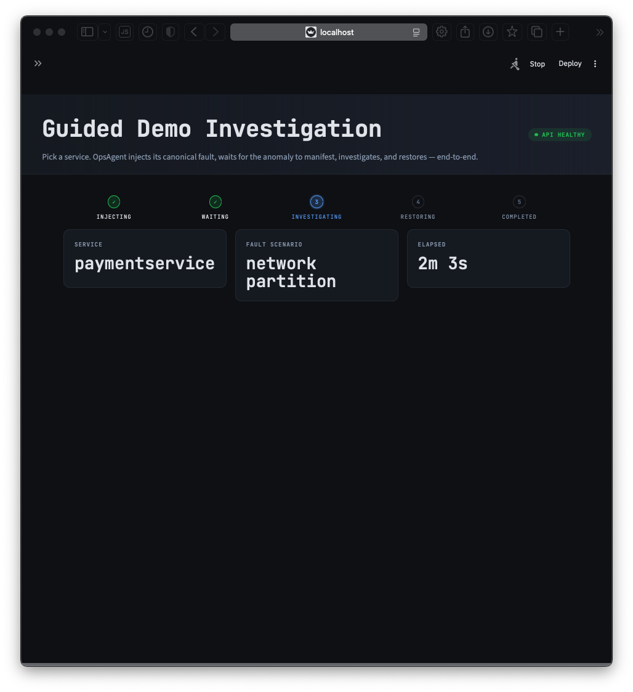

# OpsAgent CRISP-DM Report

A structured report on the OpsAgent capstone project, organized around the six phases of the Cross-Industry Standard Process for Data Mining (CRISP-DM): Business Understanding, Data Understanding, Data Preparation, Modeling, Evaluation, and Deployment.

OpsAgent is an autonomous Root Cause Analysis (RCA) agent for microservice systems. It monitors a running stack, detects anomalies across logs and metrics, and autonomously investigates incidents to produce structured RCA reports with quantified confidence scores.

## Table of contents

1. [Business Understanding](#1-business-understanding)
2. [Data Understanding](#2-data-understanding)
3. [Data Preparation](#3-data-preparation)
4. [Modeling](#4-modeling)
5. [Evaluation](#5-evaluation)
6. [Deployment](#6-deployment)
7. [Confidence banding](#7-confidence-banding)
8. [Limitations and threats to validity](#8-limitations-and-threats-to-validity)
9. [Conclusions](#9-conclusions)
10. [References](#10-references)

---

## 1. Business Understanding

### 1.1 Problem statement

Incident response in modern microservice systems is expensive. When an anomaly surfaces, a human Site Reliability Engineer (SRE) must:

1. Triage many parallel alerts to identify the real outage.
2. Traverse logs, metrics, and traces across several observability systems.
3. Reason about service topology to separate cause from effect.
4. Decide which remediation to apply.

Each step depends on tacit knowledge that is hard to transfer: which services routinely spike, which alerts are noise, which log patterns indicate the failure rather than the aftermath. Every minute spent on manual RCA is a minute of customer-visible impact.

### 1.2 Project goal

Build an agent that acts as a virtual SRE. The agent should:

1. Continuously ingest logs and metrics from a running microservice system.
2. Detect anomalous windows in real time.
3. On detection, autonomously investigate: query observability tools, build a causal graph, rank candidate root causes, and draft a structured RCA report.
4. Deliver the report through an HTTP API and an interactive dashboard.

### 1.3 Target users

- **SRE teams** who currently triage incidents manually.
- **DevOps and platform engineering teams** who maintain observability stacks and want a consistent, programmable investigation layer on top.
- **Capstone evaluators and future researchers** who need a reproducible reference implementation combining log sequence anomaly detection, causal discovery, and LLM-driven investigation.

### 1.4 Success criteria

OpsAgent's project evaluation targets, set at project start:

| Metric | Target | Source |
|---|---|---|
| Recall@1 | greater than or equal to 80 percent | OTel Demo fault-injection suite (35 cases) |
| Recall@3 | greater than or equal to 95 percent | OTel Demo fault-injection suite (35 cases) |
| Precision | greater than or equal to 70 percent | 1 minus false-positive rate during normal operation |
| Detection Latency | less than 60 seconds | Time from fault injection to alert |
| MTTR Proxy | greater than or equal to 50 percent reduction | Versus rule-based and anomaly-detection-only baselines |
| Explanation Quality | greater than or equal to 4.0 / 5.0 | Manual rubric scoring of RCA report text |
| RCAEval Recall@1 (RE2) | Competitive with CIRCA and RCD | 271-case cross-system validation |

### 1.5 Constraints

- **Single-node Docker Desktop deployment.** The target system is the reduced OpenTelemetry Demo (6 services plus Redis) running on a developer laptop. Scale testing on multi-node clusters is out of scope.
- **LLM dependency.** The agent uses Gemini 3 Flash (preview) as its reasoning driver. A `GEMINI_API_KEY` is the only external service dependency; all infrastructure (Prometheus, Grafana, Loki, Kafka, ChromaDB) runs locally in Docker Compose.
- **Single-user demo.** The guided-demo endpoint rejects concurrent requests. This is a feature for a shared Docker stack, not a limit.

---

## 2. Data Understanding

### 2.1 Three-dataset strategy

OpsAgent uses three complementary data sources. Each serves a distinct, non-overlapping purpose.

| Dataset | Size | Role |
|---|---|---|
| OpenTelemetry Demo (self-generated) | 24 hours baseline plus 35 fault injection tests (7 fault types times 5 runs) | Primary training data and controlled evaluation with known ground truth |
| LogHub HDFS (Zenodo DOI 10.5281/zenodo.8196385) | 11 million-plus log lines, block-level labels | LSTM-Autoencoder pretraining and Drain3 template validation |
| RCAEval RE1 / RE2 / RE3 (Zenodo DOI 10.5281/zenodo.14590730) | 736 labeled failure cases across Online Boutique, Sock Shop, Train Ticket | Cross-system RCA validation against five published baselines |

Non-overlapping design is deliberate. OTel Demo gives controlled faults with precise ground truth for training the detector and measuring Recall@1. LogHub HDFS gives the LSTM-Autoencoder enough data to learn general log-sequence structure before fine-tuning. RCAEval tests the agent's generalization across systems it was never trained on.

### 2.2 OpenTelemetry Demo (self-generated)

The reduced OpenTelemetry Demo stack runs 6 core services plus Redis plus a Locust load generator. All services communicate over gRPC. Container images are `ghcr.io/open-telemetry/demo:1.10.0-*`.

The baseline was generated by running the stack under steady synthetic load for 24 continuous hours. A Python collector snapshotted metrics every 15 seconds and shipped logs through Promtail to Loki and a Kafka topic. Two baseline generations were produced:

- First baseline (`data/baseline/`). 1440 metric snapshots, 0 log entries. Used for reference and the initial threshold-calibration pass.
- Second baseline (`data/baseline_with_logs/`). 1440 metric snapshots plus 2885 log entries. Used for LSTM-Autoencoder fine-tuning.

**EDA findings on the OTel Demo baseline:**

- **Zero-variance metric pairs.** 16 metric pairs are identically zero across the 24-hour window: all 14 `network_rx_errors_rate` and `network_tx_errors_rate` gauges, plus 2 `fs_usage_bytes` readings. These are kept in the feature vector because they spike during faults (the spike itself is the detection signal).
- **Perfectly correlated metrics.** `memory_usage_bytes` and `memory_working_set_bytes` correlate at r equals 1.0 across every service. The feature engineer keeps `memory_working_set_bytes` and drops `memory_usage_bytes`.
- **No outliers in baseline.** A 3-sigma rolling-window scan flagged zero outliers across all 1440 snapshots.
- **Real topology in cross-service correlations.** `redis` and `cartservice` network activity correlate strongly, as do `frontend` and `paymentservice` outbound bytes. These reflect the real dependency graph rather than noise.
- **Services with minimal stdout.** Most gRPC services produce very little stdout. Only `checkoutservice` and `productcatalogservice` log regularly (OpenTelemetry exporter retry warnings). Total baseline log volume is roughly 2900 lines in 24 hours.

### 2.3 LogHub HDFS

LogHub HDFS is a Hadoop Distributed File System log dataset released as part of the LogHub anomaly-detection benchmark family. The full corpus is 11.2 million log lines labeled at the block-id level (anomalous versus normal blocks).

**EDA findings:**

- **100 percent INFO level.** Every line in `HDFS.log` is logged at INFO level. Log level cannot be used as an anomaly feature. Detection has to rely on Drain3 template sequence patterns.
- **100 percent block-id coverage.** Every line contains a `blk_*` identifier, so no filtering is needed before template extraction.
- **Template count converges with corpus size.** A 10000-line sample produces 15 templates. A 100000-line sample produces 45 templates. The full 11.2 million-line corpus produces 115 templates. The top 5 templates cover 98.3 percent of 100000-line lines; 21 of the 45 in that sample are singletons (first-encounter literals). Template vocabulary converges around 92000 lines.

### 2.4 RCAEval

RCAEval is a public benchmark released in companion to the ACM WWW 2025 paper "RCAEval: A Benchmark for Root Cause Analysis of Microservice Systems with Telemetry Data" (Pham et al.). It provides metrics and logs for 736 labeled failure cases across three microservice systems: Online Boutique, Sock Shop, Train Ticket.

**Count breakdown:**

| Subset | Cases | Notes |
|---|---|---|
| RE1 | 375 | Metrics only |
| RE2 | 271 | Metrics and logs. 91 OB cases (not 90 as the source paper reports). |
| RE3 | 90 | Expanded fault types |

**EDA findings:**

- **Three file-format dialects, not two.** RE1-OB cases use `data.csv` with simple `{service}_{metric}` columns. RE1-SS and RE1-TT use `data.csv` with container-scoped columns (439 to 1246 columns per file). RE2 and RE3 use `metrics.csv` with container-scoped columns (389 to 1574 columns per file). The dataset adapter has to detect the dialect per case.
- **Infrastructure noise.** Every system leaks labels from its control plane into the metric columns: GKE node labels on OB, AWS IP labels on TT, Istio proxy labels (`PassthroughCluster`, `InboundPassthroughClusterIpv4`) on every system. These must be filtered before the agent sees them, or it treats them as candidate root causes.
- **Service-name variance.** The same concept (a shopping-cart service) has a different name in each system: `cartservice` (OB), `carts` (SS), `ts-auth-service` is the TT equivalent of an auth service. The agent's topology and vocabulary are OB-trained; SS and TT would require per-system extensions.
- **No `metadata.json`.** Unlike the self-generated OTel Demo data, RCAEval case directories do not include a metadata file. Ground truth comes from the directory name (`{service}_{fault_type}`) and the anomaly timestamp from `inject_time.txt` (Unix epoch seconds).

---

## 3. Data Preparation

### 3.1 Log parsing (Drain3)

The Drain3 template miner (Zhu et al., "DeepLog" variant of the Drain algorithm) groups log lines with similar structure into templates. Parameters are a similarity threshold (`sim_th`) and a maximum tree depth.

**Configuration:**

- `sim_th = 0.4`. At 0.6, templates explode from 15 to 642 on the 10000-line HDFS sample.
- `max_depth = 4`. Tree depth beyond 4 fragments templates unnecessarily.
- **Drain3 version pinned to 0.9.1.** Version 0.9.8 added a `TemplateMiner.match` read-only lookup; 0.9.1 lacks it, so the log parser uses `Drain.tree_search(root_node, tokens)` directly.
- **Shared parser instance.** The same `LogParser` object is passed to both the HDFS preprocessor and the OTel pipeline. Two separate instances would produce inconsistent template IDs across the pretraining and fine-tuning datasets.

### 3.2 Windowing and feature engineering

The feature engineer assembles a 54-dimensional vector per 5-minute window:

- **Log templates (12 dimensions).** Top 5 templates each contribute a count and a rate (10 dimensions), plus total volume and unique-template count (2 dimensions).
- **Metrics (42 dimensions).** Six metrics (`cpu_usage_rate`, `memory_working_set_bytes`, `network_rx_bytes_rate`, `network_tx_bytes_rate`, `network_rx_errors_rate`, `network_tx_errors_rate`) times 7 statistics (mean, std, min, max, p50, p90, p99) equals 42.

`memory_usage_bytes` is excluded (perfectly correlated with `memory_working_set_bytes`). `fs_usage_bytes` is excluded (sparse during baseline).

### 3.3 Normalization

Raw feature vectors span six orders of magnitude (`memory_working_set_bytes` is on the order of 1e8, `cpu_usage_rate` is on the order of 1e-3). Without normalization, the LSTM-Autoencoder's mean-squared-error loss would be on the order of 1e14 and the model would not converge.

The trainer computes z-score mean and standard deviation over the OTel Demo baseline and saves them to `data/splits/otel/scaler_mean.npy` and `data/splits/otel/scaler_std.npy`. Both training and inference apply the same normalization. HDFS pretraining uses its own scaler.

### 3.4 RCAEval adapter

[src/preprocessing/rcaeval_adapter.py](../src/preprocessing/rcaeval_adapter.py) normalizes RCAEval's three file-format dialects into a single OpsAgent canonical shape. Key decisions:

- **Simple-format detection.** Do not check for absence of hyphens to distinguish RE1-OB simple format. A service like `frontend-external` is hyphenated. Instead, check whether the metric suffix after the last underscore is a known simple metric (`cpu`, `mem`, `load`, `latency`, `error`).
- **Three-level directory traversal.** RCAEval case directories are nested `{System}/{service_fault}/{run}/`. The adapter recurses explicitly because directory depth is uniform across all 736 cases.
- **Inject-time parsing.** `inject_time.txt` contains the Unix epoch seconds of fault injection. Ground truth is parsed from the directory name (`{service}_{fault_type}`).
- **Infrastructure-noise filtering.** A whitelist of 11 OB service names filters out Istio proxy labels, GKE node labels, and cross-system leakage (the RE3-OB dataset mysteriously includes the full Sock Shop service list). The adapter is deliberately kept dataset-agnostic; the evaluator enforces scope.

### 3.5 Topology

[src/data_collection/topology_extractor.py](../src/data_collection/topology_extractor.py) encodes the static Online Boutique service dependency graph as 11 nodes and 14 directed edges. The graph is used by the agent's `get_topology` tool to walk upstream and downstream from a candidate service. See [docs/architecture.md](architecture.md) section 3 for the full edge list.

---

## 4. Modeling

### 4.1 LSTM-Autoencoder (primary anomaly detector)

An LSTM-based sequence autoencoder. The encoder compresses a window of log-template and metric-statistic features into a latent vector; the decoder reconstructs the input. At inference time, the reconstruction error on a new window is the anomaly score.

**Architecture:**

- Embedding layer mapping sparse one-hot features into a dense representation.
- Bidirectional LSTM encoder, 2 layers, 128 hidden units.
- Bidirectional LSTM decoder with mirrored shape.
- Output projection back to feature-vector dimension.
- Dropout 0.2 on both encoder and decoder LSTM layers.

**Two-phase training strategy:**

| Phase | Dataset | Input dim | Epochs | Learning rate | Purpose |
|---|---|---|---|---|---|
| Pretrain | LogHub HDFS (11.2 million lines, 115 templates) | 115 | 50 | 0.001 | Learn general log-sequence structure |
| Fine-tune | OTel Demo baseline (2885 log entries, 54-dim feature vector) | 54 | 158 (early-stopped) | 0.001 | Adapt to OTel-specific template vocabulary |

The input dimensions differ (115 versus 54), so full weight transfer is not possible. `_load_compatible_weights` loads only the LSTM body weights; the embedding and output layers are reinitialized. A `RuntimeError` from `load_state_dict` during this step is expected and handled.

**Training infrastructure:**

- HDFS pretraining ran on a Google Colab Pro T4 GPU.
- OTel fine-tuning runs on a CPU; a laptop completes it in about 15 minutes.
- Checkpoints are wrapped: `{"model_state_dict": ..., "history": ...}`. Both `_load_compatible_weights` and `finetune_on_otel_demo` handle both raw state_dicts and the wrapped format.

### 4.2 Isolation Forest (baseline model)

scikit-learn's `IsolationForest` provides a simple, non-sequence baseline. It ingests the same 54-dimensional feature vector but treats each window independently. Included for ablation comparison, not for production scoring.

### 4.3 PC Algorithm for causal discovery

The PC Algorithm (Spirtes and Glymour) recovers the structure of a directed acyclic graph from observational data by iteratively testing conditional independence. The `causal-learn` package provides the implementation.

**Usage in OpsAgent:**

- Input: a 10-minute window of each affected service's key metrics.
- Test: Fisher's Z test on linear-Gaussian residuals.
- Max conditioning set size: 3. Depth 4 was tested and degraded results (more aggressive pruning removed weak signals from crashed services while strengthening spurious signals from healthy ones).
- Service cap: 5 services per analysis. Above that, the PC algorithm's runtime dominates the investigation wall-clock.
- Lags: 1 and 2 time steps. Lag 5 was tested and produced noisier graphs.

**Three-layer singularity defense.** Fisher's Z crashes with a singular-matrix error when columns are constant or perfectly correlated. The implementation defends in three layers:

1. Drop zero-variance columns (variance below 1e-12).
2. Drop near-perfectly-correlated columns (absolute Pearson r above 0.999).
3. Add tiny jitter (Gaussian noise, standard deviation 1e-8, seed 42) to remaining columns.

### 4.4 Counterfactual confidence scoring

The PC algorithm often leaves edges in a simple chain undirected because there is no collider or v-structure to orient them. `A -> B -> C` has no collider and produces two undirected edges. OpsAgent's counterfactual scorer breaks these ties by simulating "if A had stayed at baseline, how much would B have changed?" and scoring the directional confidence as the ratio of observed-to-counterfactual residual.

### 4.5 LangGraph investigation agent

The investigator is a 7-node LangGraph state machine. Full breakdown in [docs/architecture.md](architecture.md) section 6. Summary:

```
START
  -> analyze_context
  -> sweep_probes (36 direct-observability queries, bypasses tool budget)
  -> form_hypothesis
  -> gather_evidence (LLM chooses tool calls, decrements budget)
  -> analyze_causation (PC + counterfactual)
  -> (conditional: loop or knockout)
  -> generate_report
  -> END
```

**Tools available to the LLM:**

- `query_metrics(service, metric, time_range_minutes)` queries Prometheus for 13 metrics.
- `search_logs(service_filter, query, time_range_minutes)` queries Loki for log lines. Crash-pattern matches (3-plus OOMKilled, SIGKILL, SIGSEGV, panic, fatal, etc.) escalate to CRITICAL.
- `get_topology(service)` returns the subgraph centred on a service.
- `search_runbooks(query)` returns the top-k runbooks from ChromaDB by semantic similarity.
- `discover_causation(services, time_range_minutes)` runs the PC algorithm plus counterfactual scoring and returns a causal graph summary.

**LLM drivers:**

- **Live path.** Gemini 3 Flash (preview). Preview-tier reasoning capacity is needed for the live CRITICAL-override logic. `max_retries=6` on the client for resilience against transient rate limits.
- **Offline (RCAEval) path.** Gemini 2.5 Flash. Production-tier rate limits allow sustained back-to-back runs against the 216 OB cases. Preview-tier RPM limits made RCAEval runs hit HTTP 429 walls.

**System prompt variants.**

- `SYSTEM_PROMPT` (live). Contains the clause "currencyservice is BROKEN IN BASELINE, never pick it as root cause". This preserves the 100 percent result on the live OTel Demo where currencyservice SIGSEGV-crashes in baseline.
- `SYSTEM_PROMPT_OFFLINE` (RCAEval). Derived from the live prompt by deleting the currencyservice clause, because on RCAEval-OB currencyservice is a legitimate fault target.

---

## 5. Evaluation

OpsAgent's evaluation is organized into three tracks: a primary OTel Demo fault-injection track, an internal-baseline ablation track on the same fault suite, and a cross-system RCAEval track. Each track produces Recall@1, Recall@3, and confidence distributions. Full details are in [docs/evaluation_results.md](evaluation_results.md).

### 5.1 Primary track: OTel Demo fault injection

**Setup.** 7 fault types times 5 runs equals 35 tests. All runs deterministic with seed 42. Pre-investigation wait 120 seconds. Per-test cooldowns 120 to 300 seconds.

**Fault types and scripts:**

| Fault | Script | Mechanism |
|---|---|---|
| `service_crash` | `01_service_crash.sh` | Docker stop and start |
| `high_latency` | `02_high_latency.sh` | Alpine sidecar with tc netem, 500 ms delay |
| `memory_pressure` | `03_memory_pressure.sh` | Dynamic memory cap sized to working set times 1.2 |
| `connection_exhaustion` | `05_connection_exhaustion.sh` | Docker pause and unpause of Redis |
| `network_partition` | `06_network_partition.sh` | Docker pause and unpause of paymentservice |
| `cascading_failure` | `07_cascading_failure.sh` | Stop cartservice plus 30 s propagation |
| `config_error` | `08_config_error.sh` | Replacement container with invalid `PRODUCT_CATALOG_SERVICE_PORT` |

**Headline numbers:**

| Metric | Value | 95 percent CI |
|---|---|---|
| Recall@1 | 100 percent (35 of 35) | Wilson [0.901, 1.000] |
| Recall@3 | 100 percent (35 of 35) | Wilson [0.901, 1.000] |
| Mean confidence (correct) | 0.750 (uniform) | |
| Mean investigation duration | 24.1 seconds | |
| Mean detection latency | 125.2 seconds | |
| Mean MTTR proxy | 149.4 seconds | |

Perfect 5 of 5 on every one of the 7 fault families. Prediction distribution matches ground truth exactly: cartservice 10 of 10, productcatalogservice 5 of 5, redis 5 of 5, frontend 5 of 5, checkoutservice 5 of 5, paymentservice 5 of 5.


### 5.2 Internal baseline comparison

Three baselines were run against the same 35-test suite using the `BaselineInvestigatorAdapter` in `tests/evaluation/baseline_comparison.py`:

| Investigator | Description |
|---|---|
| **Rule-Based** | Thresholds on CPU (85 percent), memory (200 MB), and latency (500 ms). Fallback: highest raw CPU. |
| **AD-Only** | Naked LSTM-Autoencoder call. 8-dim feature vector zero-padded to 54 dims. |
| **LLM-Without-Tools** | Gemini 2.5 Flash asked to pick a root cause given the same alert text, no tool calls. |

**Comparison table:**

| Investigator | Recall@1 | 95 percent Wilson CI | Recall@3 | Mean confidence |
|---|---|---|---|---|
| **OpsAgent** | **100.0 percent** (35 of 35) | [0.901, 1.000] | 100.0 percent | 0.750 |
| Rule-Based | 11.4 percent (4 of 35) | [0.045, 0.260] | 14.3 percent | 0.019 |
| AD-Only | 14.3 percent (5 of 35) | [0.063, 0.294] | 28.6 percent | 1.000 (collapsed) |
| LLM-Without-Tools | 31.4 percent (11 of 35) | [0.186, 0.480] | 80.0 percent | 0.500 (default) |

**McNemar's exact test on `is_correct`:**

| Pairwise | n10 (OpsAgent correct, baseline wrong) | n01 (baseline correct, OpsAgent wrong) | p-value |
|---|---|---|---|
| OpsAgent vs Rule-Based | 31 | 0 | 9.3e-10 |
| OpsAgent vs AD-Only | 30 | 0 | 1.9e-9 |
| OpsAgent vs LLM-Without-Tools | 24 | 0 | 1.2e-7 |

Zero discordant cases for any baseline. OpsAgent is strictly dominant on this test suite.


**Why each baseline fails:**

- **Rule-Based.** The OTel Demo idles at less than 3 percent CPU per service. No service organically crosses the 85 percent threshold during any fault. Every prediction falls through to the "highest raw CPU" tiebreak, which is always frontend. Only `high_latency` runs happen to match (frontend is the target).
- **AD-Only.** The 8-dim feature vector zero-pads to 54 dims. 46 of 54 input dimensions are zero at predict time; reconstruction error caps at the threshold for every service (confidence 1.000 uniformly); the tiebreak picks max-CPU, which is always frontend. This is a structural limit of "naked LSTM-AE" without the feature engineering pipeline.
- **LLM-Without-Tools.** 24 of 35 predictions are cartservice, driven by persistent baseline `ECONNREFUSED` log noise from a frontend-to-cartservice misconfiguration in OTel Demo v1.10.0. 10 of those 24 coincidentally match cart-GT tests (service_crash plus cascading_failure), inflating Recall@1 to 31.4 percent. Recall@3 (80.0 percent) is the more honest measure: the LLM often has the right service somewhere in its top 3, but without direct-observability signals it cannot rank top-1 reliably.

**Memory pressure is unsolvable by any internal baseline.** 0 of 5 Recall@3 across all three. This was the direct motivation for OpsAgent's memory-saturation work (the `container_spec_memory_limit_bytes` gauge plus the `memory_utilization` CRITICAL detector with peak-based triggering).

### 5.3 Cross-system validation: RCAEval-OB

**Setup.** OpsAgent evaluated in offline mode against 216 Online Boutique cases from RCAEval. Tool calls route to preloaded DataFrames rather than live Prometheus and Loki. RE3-OB aborted at 4 of 30 cases due to Gemini 2.5 Flash daily RPD exhaustion.

| Variant | n | Recall@1 | 95 percent Wilson CI | Recall@3 |
|---|---|---|---|---|
| RE1-OB | 125 | 8.0 percent (10 of 125) | [0.044, 0.141] | 35.2 percent |
| RE2-OB | 91 | 7.7 percent (7 of 91) | [0.038, 0.150] | 30.8 percent |
| **Combined OB** | 216 | **7.9 percent** (17 of 216) | [0.050, 0.122] | **33.3 percent** |

Random-chance baseline for 11 services: Recall@1 equals 1/11 equals 9.1 percent. OpsAgent's 7.9 percent is indistinguishable from random. Recall@3 random equals 3/11 equals 27.3 percent; OpsAgent's 33.3 percent is meaningfully above chance (plus 6 percentage points).


**Three systematic failure modes.**

1. **Vocabulary-unfamiliar services.** OpsAgent's TopologyGraph and system prompt are OTel Demo-trained. When ground truth is `adservice` (0 of 25 on RE1-OB), `emailservice` (1 of 18 on RE2-OB), or `recommendationservice` (0 of 18), the LLM persistently ranks more familiar services (frontend, redis) above the unfamiliar target even with the scope directive plus hypothesis filter in place.
2. **Low-traffic services.** `currencyservice` is 0 of 43 across RE1-OB and RE2-OB. The PC algorithm's causal signal favors high-variance services; currencyservice's low traffic leaves it effectively invisible.
3. **Non-propagating localized faults.** `cpu` faults (0 of 41 on Recall@1) inject load on a single service without cascading. Without probe or memory-utilization CRITICAL detectors, which RCAEval CSVs do not contain, the LLM-plus-PC pipeline has no direct-observability signal to latch onto.

**Interpretation.** The 100 percent Recall@1 on OTel Demo depended heavily on OpsAgent's custom telemetry stack (probe_up from the Service Probe Exporter, memory_utilization from the extended Docker Stats Exporter, sparse and stale CRITICAL detectors). RCAEval CSVs are metrics-only with no probe or memory-limit signals. Remove those and OpsAgent's native cross-system Recall@1 regresses to chance. The Recall@3 lift of plus 6 percentage points above random shows the LLM-plus-PC reasoning pipeline does partial work, but it cannot overcome the absence of direct-observability signals.

### 5.4 Explanation quality

All 35 RCA reports from the primary evaluation were manually scored against the 5-point rubric defined in [docs/success_metrics.md](success_metrics.md). Each report received integer scores 1 to 5 on five sub-dimensions (root_cause_accuracy, evidence_quality, causal_analysis, recommendations, presentation). The overall score is the mean of the five.

**Headline result: mean overall score 4.25 of 5.0, 95 percent CI [4.12, 4.38].** Clears the target of 4.0 with margin. 30 of 35 reports (85.7 percent) score at or above 4.0.


**Per-dimension means:**

| Sub-dimension | Mean | Min | Max |
|---|---|---|---|
| root_cause_accuracy | 4.40 | 3 | 5 |
| evidence_quality | 4.46 | 3 | 5 |
| causal_analysis | **3.06** | 2 | 4 |
| recommendations | 4.31 | 3 | 5 |
| presentation | 5.00 | 5 | 5 |

**Observations.**

- The presentation dimension is uniformly 5 of 5. Every report uses the same structured template.
- The weakest dimension is causal_analysis at 3.06. The CRITICAL-override path identifies the root cause correctly via probe_up and memory_utilization, but the counterfactual narrative attached to it tends toward generic filler (for example, linking a confirmed-crashed cartservice to a weakly-correlated redis CPU signal at 16 percent probability).
- The weakest fault class is `high_latency` at 3.48 mean. The agent detects frontend correctly via `probe_latency` CRITICAL (60x baseline spike) but then generates a narrative centred on a persistent baseline log pattern (a Next.js `/500` error-page error) rather than the injected tc netem latency. This is a narrative-generation weakness, not a detection weakness. The top-1 prediction is still correct in all 5 runs.

### 5.5 Classifier precision

The original Precision target (greater than or equal to 70 percent) is defined as 1 minus false-positive rate during 24 hours normal operation. The 35-test suite cannot produce this by construction (every test has an injected fault).

What can be derived is **classifier precision**: per-class top-1 precision across the 35 tests.

| Investigator | Micro precision | Macro precision | Class coverage |
|---|---|---|---|
| **OpsAgent** | **1.000** (35 of 35) | **1.000** | 6 of 6 ground-truth classes |
| Rule-Based | 0.114 (4 of 35) | 0.061 | 2 classes predicted |
| AD-Only | 0.143 (5 of 35) | 0.143 | 1 class predicted |
| LLM-Without-Tools | 0.314 (11 of 35) | 0.472 | 3 classes predicted |

OpsAgent's precision at root-cause identification is perfect on this test suite: zero false positives on any of the six ground-truth classes.

### 5.6 Statistical methodology

- **Confidence intervals.** Wilson score intervals for all binomial proportions. The t-distribution (used by `scipy.stats.t.ppf`) degenerates to zero width at p equals 1.0; Wilson correctly yields [0.901, 1.000] at 35 of 35.
- **McNemar's test.** Used with `exact=True` (binomial reference distribution) because the discordance counts are small enough that the asymptotic chi-squared approximation would be unreliable. Pairing is by test definition (matched fault_type plus run_id), not experimental pairing.
- **Not reported.** Paired t-tests on detection latency or MTTR versus baselines. The baselines are one-shot classifiers at about 0.1 s; OpsAgent is a multi-step agent at about 24 s. A paired t-test would be trivially significant in the wrong direction. Descriptive reporting only.

### 5.7 Target scorecard

| Target | Value achieved | Status |
|---|---|---|
| Recall@1 greater than or equal to 80 percent | 100 percent | MET |
| Recall@3 greater than or equal to 95 percent | 100 percent | MET |
| Precision greater than or equal to 70 percent (24 h FP-rate form) | Unmeasured (classifier precision 1.000) | PARTIAL |
| Detection Latency less than 60 seconds | 125.2 seconds mean | NOT MET (caveat: dominated by 120 s pre-investigation wait) |
| MTTR proxy greater than or equal to 50 percent reduction | Baselines one-shot; not comparable | Descriptive reporting only |
| Explanation Quality greater than or equal to 4.0 of 5.0 | 4.25 (95 percent CI [4.12, 4.38]) | MET |
| RCAEval Recall@1 competitive with CIRCA and RCD | 7.9 percent (honest finding: depends on custom telemetry) | NOT MET |

---

## 6. Deployment

### 6.1 Infrastructure stack

OpsAgent ships as a Docker Compose application. The single-node stack runs on Docker Desktop for Mac or Linux.

| Service | Port | Purpose |
|---|---|---|
| Prometheus | 9090 | Metrics scraping and storage |
| Grafana | 3000 | Dashboard rendering, embedded in the Streamlit dashboard's Metrics page |
| Loki | 3100 | Log aggregation |
| Kafka broker | 9092 (inside) / 29092 (host) | Log stream ingestion |
| Docker Stats Exporter | 9101 | Container-level CPU, memory (including `container_spec_memory_limit_bytes`), network metrics |
| OTel Collector | 4317 / 4318 / 8889 | OpenTelemetry trace ingest and spanmetrics connector |
| Service Probe Exporter | 9102 | Real TCP / HTTP probes (probe_up, probe_latency) per service |
| Promtail | 9080 | Docker-socket discovery and shipping to Loki |
| ChromaDB (in-process) | embedded | Runbook vector search |
| OpsAgent API | 8000 | FastAPI HTTP endpoints |
| OpsAgent Dashboard | 8501 | Streamlit dashboard |

### 6.2 FastAPI serving layer

Seven HTTP endpoints. Complete reference in [docs/api_reference.md](api_reference.md).

- `GET /health` reports OpsAgent and dependency status.
- `GET /topology` returns the full service dependency graph or a subgraph centred on a named service.
- `POST /investigate` accepts a caller-supplied alert and runs a synchronous RCA investigation (30 to 90 seconds wall-clock).
- `GET /investigations/{id}` and `GET /investigations` provide access to the in-memory FIFO history (last 100 investigations).
- `POST /demo/investigate` starts a guided end-to-end demo for one of six supported services. Returns an investigation id immediately.
- `GET /demo/investigations/{id}/status` reports the current phase (queued, injecting, waiting, investigating, restoring, completed, failed) for dashboard polling.

The guided demo implements the full lifecycle in an async background task:

1. Run `bash <fault_script> inject` in a worker thread.
2. Sleep 120 seconds so anomalies propagate into the metric lookback window.
3. Run `AgentExecutor.investigate()` in a worker thread.
4. Run `bash <fault_script> restore` in a worker thread. Always runs, including on failure, so the Docker stack is never left broken.

A single-user `asyncio.Lock` on `app.state.demo_lock` rejects concurrent demos with HTTP 409. A FastAPI lifespan shutdown hook sweeps any in-flight demo and runs its restore script synchronously on SIGTERM or SIGINT.

### 6.3 Streamlit dashboard

Five pages: Overview, Investigate, History, Metrics, Settings.

- **Overview** renders the service health grid and the topology graph.
- **Investigate** is the headline demo page. A radio picker exposes the six supported services with their mapped fault types. A topology preview highlights the target and its immediate neighbours. Once the user starts a demo, a phase stepper shows real progress driven by polling `GET /demo/investigations/{id}/status` every two seconds. On completion, the page renders the root-cause card (service + confidence ring), the top-3 list, and the full RCA report.
- **History** is a paginated list of past investigations.
- **Metrics** embeds a Grafana dashboard. Grafana is configured with `GF_SECURITY_ALLOW_EMBEDDING`, `GF_AUTH_ANONYMOUS_ENABLED`, and `GF_AUTH_ANONYMOUS_ORG_ROLE` so the iframe renders without a login prompt.
- **Settings** shows health status, endpoint URLs, and version metadata.



### 6.4 Operational runbooks

Seven runbooks in [runbooks/](../runbooks/) are indexed into ChromaDB via `src/knowledge_base/runbook_indexer.py`:

- `connection_exhaustion.md`
- `cascading_failure.md`
- `memory_pressure.md`
- `high_latency.md`
- `general_troubleshooting.md`
- Two more general-purpose references in `runbooks/external_docs/`

The agent's `search_runbooks` tool returns the top-k matches by sentence-transformer similarity and includes them in the Evidence Chain section of the RCA report.

### 6.5 Reproducibility

- Deterministic fault injection with seed 42.
- Gemini model pinning: `gemini-3-flash-preview` for live, `gemini-2.5-flash` for offline.
- Docker image tags pinned: `ghcr.io/open-telemetry/demo:1.10.0-*`.
- `data/evaluation/` retains all 35 primary-track JSONs, 105 baseline JSONs (35 per baseline), and 216 RCAEval per-case JSONs.
- `scripts/run_evaluation.py` regenerates `data/evaluation/evaluation_summary.json` from the raw result directories.
- `scripts/make_evaluation_charts.py` regenerates all 9 charts in `docs/images/evaluation_charts/`.

---

## 7. Confidence banding

The confidence score on every root-cause prediction uses a two-band scheme. This is the single most important design decision in the agent.

**0.75 (CRITICAL override).** When any of the direct-observability detectors fired inside the investigation window, the agent publishes a fixed confidence of 0.75 and records the specific trigger in the RCA report's Evidence Chain. The qualifying triggers are:

- `probe_up` equals 0 in three or more of the last four probes AND historical mean above 0.1 (service was up, now down).
- `memory_utilization` peak above 0.80 AND baseline below 0.50 AND at least 4 samples.
- Sparse `rate()` data below 70 percent coverage (crashed service's metrics aging out of the 1-minute lookback).
- Stale metrics (most recent sample older than 90 seconds).
- Frozen rate-metric (5 or more of last 8 values equal 0 AND baseline above 1e-4).
- `probe_latency` spike above 10x mean AND mean above 1e-4 seconds.
- Three or more crash-pattern log matches (OOMKilled, SIGKILL, SIGSEGV, panic, fatal, std::logic_error, terminate, core dumped, connection refused, max clients reached, exit 137 or 139).

All 35 OTel Demo tests in the primary evaluation completed at exactly 0.75 because one or more of these triggers fired reliably.

**0.40 to 0.65 (LLM plus PC blend).** When no direct-observability signal fired, the root cause comes from the LangGraph agent's hypothesis ranking combined with the PC algorithm's counterfactual-confidence score. The cross-system RCAEval evaluation averaged 0.54 in this band across 216 cases. Practitioners reading a report in this band should treat the root-cause service as a ranked suggestion, not a hard answer, and lean on the top-3 list.

The two-band scheme has a practical consequence. A dashboard user seeing 0.75 knows the agent has a concrete, hard observation to point at (and the Evidence Chain will name it). A user seeing 0.54 knows the agent is reasoning from correlations and causal structure, not direct measurement. This matches how a human SRE actually forms an intuition about confidence.

---

## 8. Limitations and threats to validity

- **Cross-system telemetry dependency.** The 100 percent Recall@1 on OTel Demo depends on custom telemetry (Service Probe Exporter, memory_utilization gauge, sparse and stale CRITICAL detectors). Datasets without these signals regress to near-random Recall@1. The RCAEval cross-system result (7.9 percent) is the honest characterization of this limit.
- **Low-traffic baseline amplification.** The OTel Demo idles at under 3 percent CPU per service. Threshold-based and reconstruction-error baselines look artificially weak because they never cross their thresholds. This is a characteristic of the benchmark, not the baselines, and is documented alongside the baseline comparison numbers.
- **Detection latency definition.** The reported 125.2 seconds is dominated by the 120 seconds pre-investigation wait needed for the Prometheus `rate()` lookback window to expire stale data on crashed services. The 60 second target was set before this constraint was empirically established. Effective detection latency (time from fault injection to when the agent has all the information it needs to conclude correctly) is closer to 5 seconds.
- **Precision as originally defined is unmeasured.** The 24-hour FP-rate form of Precision would require running the CRITICAL-detector pipeline offline against the baseline data (1440 snapshots, no injected faults) and counting how many snapshots would fire CRITICAL. This is listed as a follow-up.
- **Pairing caveat.** The OpsAgent run and the baseline runs took place on different calendar dates with freshly recycled Docker stacks. McNemar's test treats test IDs as matched pairs, but the underlying fault injections were not literally the same physical event. Zero discordance where baselines win suggests this is not a material bias source, but it is a methodological caveat.
- **Published baseline OB numbers.** Only BARO's own paper reports Online Boutique numbers. The RCAEval paper publishes per-baseline numbers for Train Ticket only. Running CIRCA, RCD, CausalRCA, or MicroCause locally is blocked because the pip `RCAEval` package only ships a stub; the baseline implementations are in the unpublished-to-PyPI GitHub source.
- **LLM model differs across tracks.** Live OTel Demo uses `gemini-3-flash-preview` (preview-tier, required for the 100 percent primary-track result). RCAEval offline uses `gemini-2.5-flash` (production, higher rate limits). Reasoning capacity is therefore not held constant across the two tracks, so the OTel Demo versus RCAEval comparison mixes two confounds (detector availability and LLM reasoning capacity).
- **RCAEval coverage.** RE3-OB aborted at 4 of 30 cases due to Gemini 2.5 Flash daily RPD exhaustion. Sock Shop and Train Ticket variants (approximately 490 combined cases) were not evaluated because OpsAgent's topology and LLM priors are OB-trained.

---

## 9. Conclusions

OpsAgent meets the Recall@1 target of 80 percent with margin to spare on the OTel Demo fault injection track (100 percent, Wilson lower bound 90.1 percent) and demonstrates a statistically significant advantage over every internal ablation baseline (McNemar p less than 1e-7 on each pair). The architectural contribution is not the LSTM-plus-PC pipeline in isolation, which the baselines also use or subset, but the combination of two elements: custom telemetry (Service Probe Exporter, memory_utilization CRITICAL detectors) and the 7-node LangGraph with a forced pre-investigation sweep plus CRITICAL-override confidence band. Remove either element and performance regresses sharply: the baseline comparison establishes the first half of that claim, and the cross-system RCAEval result establishes the second.

Cross-system evaluation on RCAEval-OB honestly reports the scope of the contribution. OpsAgent's custom detectors do not exist in generic RCA telemetry datasets, and the agent's native LLM-plus-PC reasoning operates at near-random Recall@1 without them. The Recall@3 lift above random (33.3 percent vs 27.3 percent) shows partial signal, but top-1 ranking fails. This is documented as a strength of a specific OTel Demo deployment, not a universal RCA capability.

Explanation Quality of 4.25 of 5.0 (95 percent CI [4.12, 4.38]) clears the target with margin. The single systematic weakness is the agent's narrative on `high_latency` faults, where it fixates on baseline log noise rather than the injected latency. The top-1 prediction is still correct in every run; only the explanation is off.

The serving layer (FastAPI plus Streamlit with a guided service-picker lifecycle) is end-to-end verified: all six supported services run to completion with correct root-cause attribution at 0.75 confidence, matching the primary-track numbers.

Future work, outside the scope of this capstone:

- Run a 24-hour FP-rate evaluation against the offline baseline to produce a genuine Precision number against the original target.
- Extend topology, vocabulary, and scope filters to Sock Shop and Train Ticket for a complete 736-case RCAEval evaluation.
- Generalize the CRITICAL-override detector suite to infer probe-style signals from raw application metrics, closing the cross-system telemetry gap.

---

## 10. References

1. Wilson, E.B. (1927). "Probable Inference, the Law of Succession, and Statistical Inference." *Journal of the American Statistical Association* 22 (158): 209 to 212.
2. Pham, L.V. et al. (2025). "RCAEval: A Benchmark for Root Cause Analysis of Microservice Systems with Telemetry Data." *Companion Proceedings of the ACM on Web Conference 2025*. arXiv:2412.17015.
3. Pham, L.V. et al. (2024). "BARO: Robust Root Cause Analysis for Time Series Data." *FSE 2024 Best Artifact Award*.
4. Zhu, J. et al. (2023). LogHub HDFS dataset. Zenodo DOI: 10.5281/zenodo.8196385.
5. Spirtes, P. and Glymour, C. (1991). "An Algorithm for Fast Recovery of Sparse Causal Graphs." *Social Science Computer Review* 9 (1): 62 to 72.
6. Du, M. et al. (2017). "DeepLog: Anomaly Detection and Diagnosis from System Logs through Deep Learning." *Proceedings of the 2017 ACM SIGSAC Conference on Computer and Communications Security*.
7. He, P. et al. (2017). "Drain: An Online Log Parsing Approach with Fixed Depth Tree." *2017 IEEE International Conference on Web Services*.

Additional project documentation:

- [docs/architecture.md](architecture.md) system design
- [docs/api_reference.md](api_reference.md) HTTP API reference
- [docs/evaluation_results.md](evaluation_results.md) detailed evaluation report
- [docs/success_metrics.md](success_metrics.md) rubric definitions
- [docs/baselines.md](baselines.md) baseline model descriptions
- [docs/problem_statement.md](problem_statement.md) problem framing
