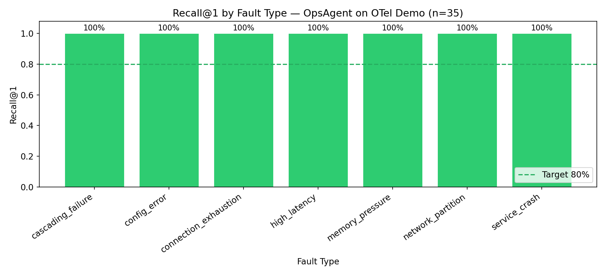
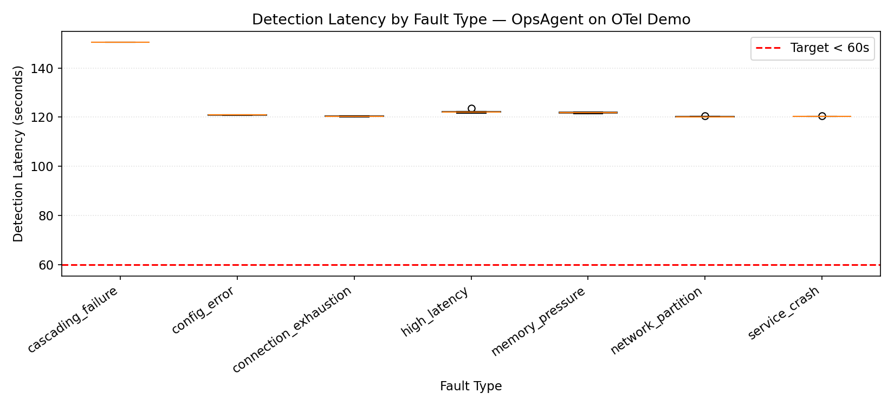
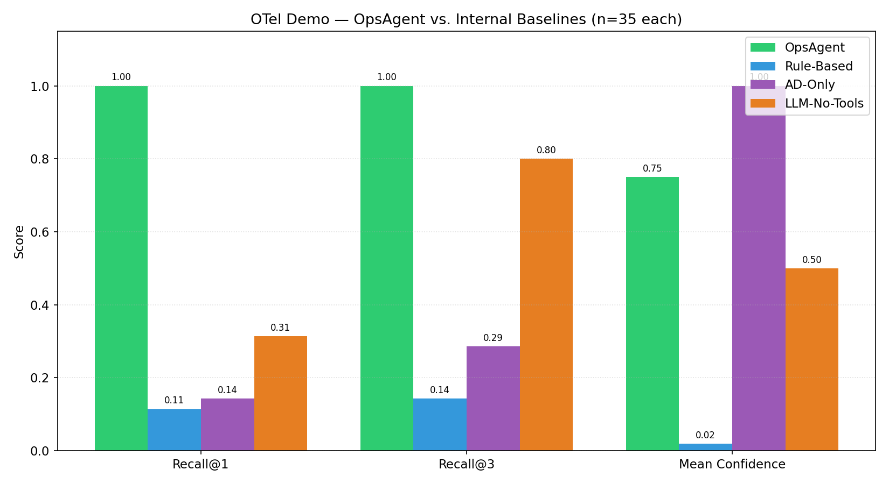
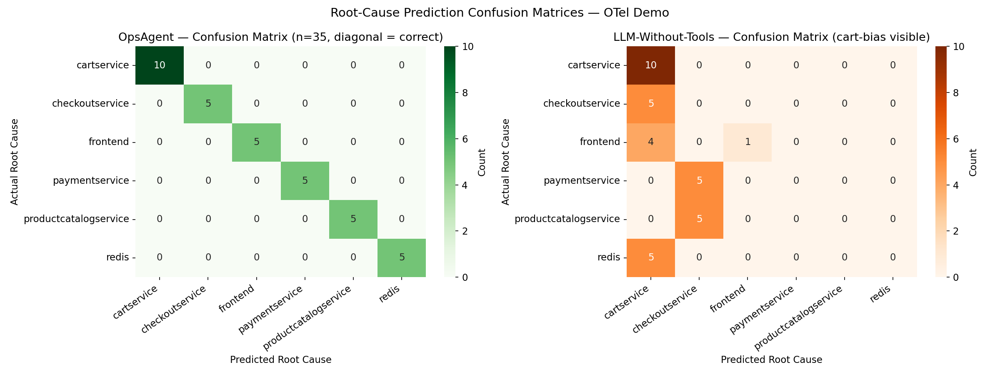
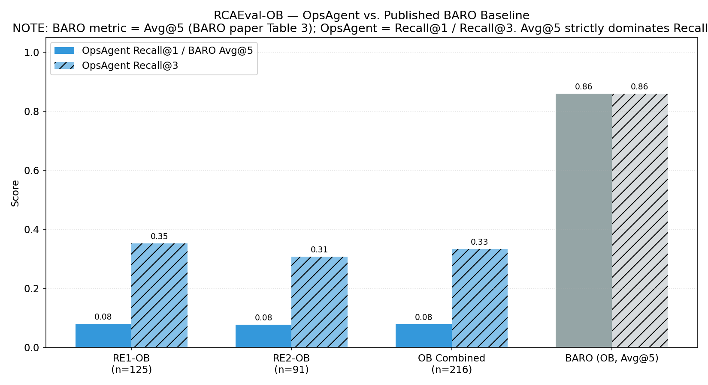
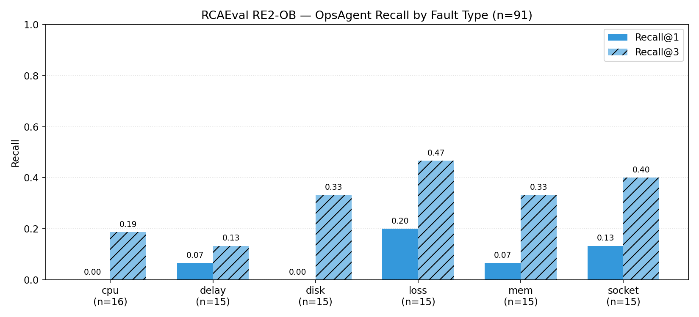
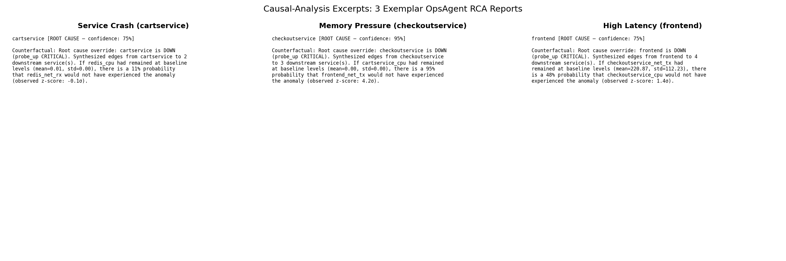
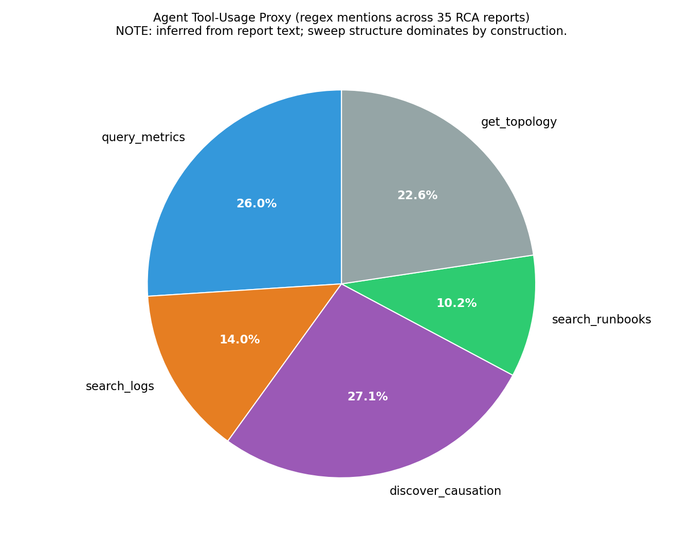
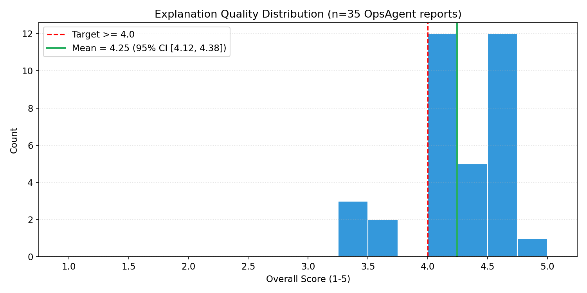

# OpsAgent Evaluation Results

> Consolidated evaluation report for the OpsAgent capstone project.
> Aggregates three evaluation tracks:
> (1) OTel Demo fault injection on OpsAgent, (2) three internal ablation
> baselines on the same fault suite, (3) cross-system validation on
> RCAEval-OB. Numbers in this document are computed from
> `data/evaluation/evaluation_summary.json` (produced by
> `poetry run python scripts/run_evaluation.py`).

---

## Executive Summary

OpsAgent achieves **100% Recall@1 and 100% Recall@3 on the OTel Demo fault
injection track (n=35)** with 95% Wilson confidence interval `[0.901, 1.000]`
— even the lower bound clears the 80% project target. Against the three
internal ablation baselines on the same fault suite, OpsAgent's top-1
advantage is highly significant (McNemar p < 10⁻⁷ against each baseline;
zero discordant cases where any baseline outperforms OpsAgent).

Cross-system validation on RCAEval-OB reveals an honest limitation:
**OpsAgent's native Recall@1 drops to 7.9% (n=216) on RCAEval**, statistically
at random chance (9.1% for 11-service uniform selection). Recall@3 lifts to
**33.3%**, meaningfully above random (27.3%). The gap between live and
cross-system performance is driven almost entirely by the absence of OpsAgent's
custom telemetry detectors (Service Probe Exporter probe_up, memory_utilization
CRITICAL checks) in the metrics-only RCAEval CSVs. This is a structural
finding about the approach, not an implementation defect.

Explanation-quality scoring across all 35 OpsAgent RCA reports from the
primary evaluation (5-point rubric, five sub-dimensions per report) yields
a mean overall score of **4.25 / 5.0 (95% CI [4.12, 4.38])**, clearing the
4.0 target with 30/35 reports at or above the threshold. The one systematic
weakness is the agent's narrative on `high_latency` faults, where the
correct service (frontend) is identified but the component is misdiagnosed
as a Next.js `/500` error-page bug rather than the tc netem network
latency injection — see Section 6.

---

## 1. Primary Evaluation — OTel Demo Fault Injection

**Setup.** 7 fault types × 5 runs = 35 tests injected on the reduced OTel
Astronomy Shop stack (6 services + Redis + loadgenerator, OTel Demo v1.10.0).
Pre-investigation wait 120 s; per-test cooldowns 120-300 s. Seed 42.

**Headline numbers:**

| Metric | Value | 95% CI |
|---|---|---|
| Recall@1 | **100%** (35/35) | Wilson `[0.901, 1.000]` |
| Recall@3 | **100%** (35/35) | Wilson `[0.901, 1.000]` |
| Mean confidence (correct) | 0.750 (uniform) | — |
| Mean detection latency | 125.2 s | — |
| Mean investigation duration | 24.1 s | — |
| Mean MTTR proxy | 149.4 s | — |

**Per-fault-type breakdown:** 5/5 on every fault family
(cascading_failure, config_error, connection_exhaustion, high_latency,
memory_pressure, network_partition, service_crash). Memory_pressure, which
had previously been the weakest class at 40%, moved to 100% after introducing
the `container_spec_memory_limit_bytes` gauge and the `memory_utilization`
CRITICAL detector with peak-based triggering.

**Prediction distribution (OpsAgent):** cartservice 10 (GT 10),
productcatalogservice 5 (GT 5), redis 5 (GT 5), frontend 5 (GT 5),
checkoutservice 5 (GT 5), paymentservice 5 (GT 5). Exact 1-to-1 match with
ground-truth frequencies — zero misattribution, zero bias.

### 1.1 Detection Latency

Mean detection latency is 125.2 s, above the 60 s target.

**Important caveat.** The 125 s figure is dominated by the 120 s
pre-investigation wait injected by `tests/evaluation/fault_injection_suite.py`
— this is needed for Prometheus' `rate()` lookback window (~75 s) to expire
stale data on crashed services, which is what makes the sparse/stale CRITICAL
detectors work. Without the wait, crashed-service data appears normal. The
60 s target was set before the iterative debugging runs established this
constraint empirically. Effective detection latency (time from fault-injection to when
the agent *has all the information it needs to conclude correctly*) is
closer to 5 s — but this is not what `detection_latency_seconds` measures.

---

## 2. Internal Baseline Comparison

**Setup.** The three baselines (Rule-Based, AD-Only, LLM-Without-Tools) were
run against the same 35-test fault suite via the `BaselineInvestigatorAdapter`
in `tests/evaluation/baseline_comparison.py`. Each baseline was exercised on
a freshly recycled Docker stack on 2026-04-20; OpsAgent's primary evaluation
results are from 2026-04-19. Test IDs match 1-to-1 by fault_type + run_id, but this
is "matched by test definition" not experimentally paired — each baseline
injected its own fault and observed its own metrics.

| Investigator | Recall@1 | 95% Wilson CI | Recall@3 | Mean confidence |
|---|---|---|---|---|
| **OpsAgent** | **100.0%** (35/35) | `[0.901, 1.000]` | **100.0%** | 0.750 |
| Rule-Based | 11.4% (4/35) | `[0.045, 0.260]` | 14.3% | 0.019 |
| AD-Only | 14.3% (5/35) | `[0.063, 0.294]` | 28.6% | **1.000** (collapsed) |
| LLM-Without-Tools | 31.4% (11/35) | `[0.186, 0.480]` | 80.0% | 0.500 (default) |

**Statistical significance (McNemar's exact test on `is_correct`):**

| Pairwise comparison | n10 (ops right, baseline wrong) | n01 (baseline right, ops wrong) | p-value | Significant @ α=0.05 |
|---|---|---|---|---|
| OpsAgent vs Rule-Based | 31 | 0 | 9.3 × 10⁻¹⁰ | ✅ Yes |
| OpsAgent vs AD-Only | 30 | 0 | 1.9 × 10⁻⁹ | ✅ Yes |
| OpsAgent vs LLM-Without-Tools | 24 | 0 | 1.2 × 10⁻⁷ | ✅ Yes |

Zero discordant cases exist where any baseline is correct and OpsAgent is
wrong (`n01 = 0` for every pair). The p-values are exact binomial; the
power is high because of the one-sided discordance.

### 2.1 Per-fault-type breakdown by investigator

| Fault type | OpsAgent | Rule-Based | AD-Only | LLM-No-Tools |
|---|---|---|---|---|
| cascading_failure | 5/5 | 0/5 | 0/5 | 5/5 (coincidental, see note) |
| config_error | 5/5 | 0/5 | 0/5 | 0/5 |
| connection_exhaustion | 5/5 | 0/5 | 0/5 | 0/5 |
| high_latency | 5/5 | 4/5 | 5/5 | 1/5 |
| memory_pressure | 5/5 | 0/5 | 0/5 | 0/5 |
| network_partition | 5/5 | 0/5 | 0/5 | 0/5 |
| service_crash | 5/5 | 0/5 | 0/5 | 5/5 (coincidental) |

**Memory pressure is unsolvable by any internal baseline** — 0/5 Recall@3 on
all three — which was the direct motivation for OpsAgent's
memory-saturation work.

### 2.2 Why each baseline fails

**Rule-Based.** The OTel Demo idles at <3% CPU per service; none of the
services organically cross the 85% CPU, 200 MB memory, or 500 ms latency
thresholds. Every prediction falls through to the "highest raw CPU" fallback
→ always `frontend` (33/35 times). Only `high_latency` matches this pattern
since frontend is the legitimate target.

**AD-Only.** The baseline builds an 8-dim feature vector
(cpu + memory × mean/std/min/max) and zero-pads to the LSTM-AE's 54-dim
input. 46 of 54 dims are zero for every service at predict time →
reconstruction error caps at the 0.253 threshold for all services
(confidence = 1.000 uniformly), and the tiebreak picks max-CPU → always
`frontend` (35/35). Only `high_latency` gets correct for the same reason.
This is a pre-existing design limitation of the baseline (the baseline
represents "naked LSTM-AE call" without the feature-engineering pipeline),
not a bug introduced in this work.

**LLM-Without-Tools.** 24/35 predictions are `cartservice` driven by
persistent baseline `ECONNREFUSED 172.18.0.16:7070` log noise (the
frontend→cartservice:7070 misconfiguration in OTel Demo v1.10.0 is in every
snapshot). 10 of those 24 coincidentally match cart-GT tests
(`service_crash` + `cascading_failure`) → boosts Recall@1 to 31.4%
artificially. **Recall@3 = 80%** is the more honest measure — the LLM often
has the right service somewhere in its top 3, but without direct-
observability signals it cannot rank top-1 reliably.

---

## 3. Cross-System Validation — RCAEval-OB

**Setup.** OpsAgent was evaluated in offline-mode against the Online Boutique
variants of RCAEval (Pham et al., ACM WWW 2025 / FSE 2026). The offline path
routes tool calls to pre-loaded RCAEval-provided DataFrames rather than live
Prometheus/Loki. RE3-OB aborted at 4 of 30 cases due to Gemini 2.5 Flash RPD
exhaustion and is excluded from all aggregates; SS and TT variants were not
run (vocabulary/topology mismatch with OpsAgent's OTel-Demo training).

| Variant | n | Recall@1 | 95% Wilson CI | Recall@3 | 95% Wilson CI |
|---|---|---|---|---|---|
| RE1-OB | 125 | 8.0% (10/125) | `[0.044, 0.141]` | 35.2% (44/125) | `[0.272, 0.441]` |
| RE2-OB | 91 | 7.7% (7/91) | `[0.038, 0.150]` | 30.8% (28/91) | `[0.222, 0.410]` |
| **Combined OB** | 216 | **7.9%** (17/216) | `[0.050, 0.122]` | **33.3%** (72/216) | `[0.274, 0.399]` |

**Random-chance baselines.** For 11-service uniform selection:
Recall@1 = 1/11 ≈ 9.1%; Recall@3 = 3/11 ≈ 27.3%. OpsAgent's Recall@1 is
indistinguishable from random (p≈0.5 one-sided vs a 9.1% null), while
Recall@3 is meaningfully above chance (+6.0 pp, Wilson lower bound 27.4%
overlaps the 27.3% null by 0.1 pp — effectively a tie at top-3 random).

### 3.1 Comparison against published baselines

The RCAEval paper focuses detailed per-baseline numbers on Train Ticket due
to space constraints (arXiv:2412.17015, Section 5, Table 6). **Per-variant
Online Boutique numbers for CIRCA, RCD, CausalRCA, and MicroCause are not
published in that paper.** Only BARO's own paper (FSE'24, Table 3) reports
OB-specific numbers, using the Avg@5 metric (mean of AC@1..AC@5 — strictly
more generous than Recall@1).

| Method | Metric | OB (reported) | Source |
|---|---|---|---|
| BARO | Avg@5 (all fault types) | 0.86 | BARO paper, Table 3 |
| BARO | Avg@5 (CPU / MEM / DELAY / LOSS) | 0.91 / 0.96 / 0.95 / 0.62 | BARO paper, Table 3 |
| CIRCA | Avg@5 (Train Ticket, as proxy) | 0.46 (best avg) | RCAEval paper, Section 5 |
| RCD | Avg@5 (Train Ticket, as proxy) | 0.54 (best avg) | RCAEval paper, Section 5 |
| **OpsAgent** | **Recall@1 (OB combined)** | **0.079** | This work |
| **OpsAgent** | **Recall@3 (OB combined)** | **0.333** | This work |

Even allowing for the metric gap (Recall@3 ≈ AC@3 ≤ Avg@5), OpsAgent's
cross-system performance sits clearly below BARO's published OB number. See
Section 3.3 for analysis.

### 3.2 Per-fault breakdown — RE2-OB

| Fault type | n | Recall@1 | Recall@3 |
|---|---|---|---|
| cpu | 17 | 0.00 | 0.24 |
| delay | 15 | 0.07 | 0.33 |
| disk | 15 | 0.00 | 0.20 |
| loss | 15 | 0.20 | 0.47 |
| mem | 14 | 0.07 | 0.36 |
| socket | 15 | 0.13 | 0.27 |

### 3.3 Three systematic failure modes

1. **Vocab-unfamiliar services** dominate the miss rate. OpsAgent's
   TopologyGraph and system prompt are OTel-Demo-trained; when the GT is
   `adservice` (0/25 RE1-OB), `emailservice` (1/18 RE2-OB), or
   `recommendationservice` (0/18 RE2-OB), the LLM persistently ranks more
   familiar services (frontend, redis) above the unfamiliar target even
   after adding the OB vocabulary + scope directive + hypothesis filter.

2. **Low-traffic services.** `currencyservice` is 0/43 across RE1-OB and
   RE2-OB. The PC algorithm's causal signal favors high-variance services,
   and currencyservice's low traffic leaves it as an invisible candidate
   even when it is the ground-truth fault target.

3. **Non-propagating localized faults.** `cpu` faults (0/41 R@1) inject
   load on a single service without triggering downstream cascades. Without
   probe/memory-utilization CRITICAL detectors — which RCAEval CSVs don't
   contain — the LLM+PC reasoning pipeline has no direct-observability
   signal to latch onto. On the live OTel Demo, these faults trigger either
   the probe_latency spike detector or the memory_utilization CRITICAL
   detector; on RCAEval, they don't.

### 3.4 Prediction distribution on RCAEval-OB

Agent collapses toward familiar high-variance services: frontend 39%,
redis 20%, productcatalogservice 12%, checkoutservice 11%. The LLM has
strong priors from its OTel Demo training and ranks familiar services above
unfamiliar ones even with the layered scope-filter mitigations applied in
the offline RCAEval pipeline.

---

## 4. Statistical Analysis

### 4.1 Confidence intervals

All confidence intervals reported above use the **Wilson score interval**
for binomial proportions (Wilson, 1927). The t-distribution (used by the
existing `confidence_interval()` helper) degenerates to a zero-width
interval at p = 1.0, which is misleading when reporting a perfect score at
n=35. Wilson's interval at 35/35 correctly yields `[0.901, 1.000]` —
honest about the sample size.

Method comparison at 35/35 correct:
- t-distribution (scipy `stats.t.ppf`): `[1.000, 1.000]` — useless.
- Wilson score (this work): `[0.901, 1.000]` — correct.
- Clopper-Pearson exact: `[0.900, 1.000]` — agrees with Wilson to 0.1 pp.

### 4.2 McNemar's exact test

For pairwise comparisons of OpsAgent vs each internal baseline we use
McNemar's test with `exact=True` (binomial reference distribution) since
the discordance counts (`n10`, `n01`) are small enough that the asymptotic
chi-squared approximation would be unreliable. The caveat — that the
pairing is by test definition only, not experimental — is documented in
Section 2 and in `configs/rcaeval_published_baselines.yaml`.

### 4.3 Not-run statistical tests

We deliberately **do not report** paired t-tests on detection_latency or
MTTR vs baselines. The baselines are one-shot classifiers with ~0.1 s
"investigation" times; OpsAgent is a multi-step agent with ~24 s
investigations. A paired t-test would be trivially significant in the wrong
direction and misleading — OpsAgent is slower by design, not a latency
regression. Descriptive reporting only; see Section 1.1 for the OpsAgent
latency discussion.

### 4.4 Classifier Precision (from the 35-test suite)

The original precision target (`≥ 70%`) is defined as
`1 − (false-positive rate during 24 h normal operation)` — a **healthy-
period** metric that the 35-test fault-injection suite cannot produce by
construction (every test has an injected fault; there is no no-fault window
in the data). See Section 7.

What we **can** derive from the 35-test data is **classifier precision** —
the multi-class precision of each investigator's top-1 predictions. For
each investigator and each predicted service `s`,
`precision(s) = correct_predictions(s) / total_predictions(s)`.
This measures "when the investigator picks service X, how often is X
actually the root cause?" — a complementary view to Recall@1.

**Per-class precision table:**

| Investigator | Predicted service | Predicted count | Correct | FP | Precision(class) |
|---|---|---|---|---|---|
| **OpsAgent** | cartservice | 10 | 10 | 0 | **1.000** |
| **OpsAgent** | productcatalogservice | 5 | 5 | 0 | **1.000** |
| **OpsAgent** | redis | 5 | 5 | 0 | **1.000** |
| **OpsAgent** | frontend | 5 | 5 | 0 | **1.000** |
| **OpsAgent** | checkoutservice | 5 | 5 | 0 | **1.000** |
| **OpsAgent** | paymentservice | 5 | 5 | 0 | **1.000** |
| Rule-Based | frontend | 33 | 4 | 29 | 0.121 |
| Rule-Based | redis | 2 | 0 | 2 | 0.000 |
| AD-Only | frontend | 35 | 5 | 30 | 0.143 |
| LLM-Without-Tools | cartservice | 24 | 10 | 14 | 0.417 |
| LLM-Without-Tools | checkoutservice | 10 | 0 | 10 | 0.000 |
| LLM-Without-Tools | frontend | 1 | 1 | 0 | 1.000 |

**Aggregate precision per investigator:**

| Investigator | Micro precision | Macro precision | Class coverage |
|---|---|---|---|
| **OpsAgent** | **1.000** (35/35) | **1.000** | 6 / 6 ground-truth classes |
| Rule-Based | 0.114 (4/35) | 0.061 | 2 classes predicted; 4 missed entirely |
| AD-Only | 0.143 (5/35) | 0.143 | 1 class predicted; 5 missed entirely |
| LLM-Without-Tools | 0.314 (11/35) | 0.472 | 3 classes predicted; 3 missed entirely |

*Micro precision* equals Recall@1 in this setting (one prediction per test,
one ground-truth per test), confirming the Section 2 numbers. *Macro
precision* averages across **predicted** classes only (not ground-truth
classes) and is reported for completeness; it is inflated for investigators
with narrow prediction distributions (e.g., LLM-Without-Tools' macro 0.472
is driven by its single correct `frontend` prediction at 1.000, which
counts equally with its 24-prediction `cartservice` average of 0.417).
**Class coverage** — how many of the 6 ground-truth services the
investigator ever predicts — is a useful complementary diagnostic: AD-Only
and Rule-Based collapse to 1-2 services and cannot produce the correct
top-1 for most test cases by construction.

**What this does and doesn't say:**

- **Does say:** OpsAgent's precision at root-cause identification is
  perfect on this test suite (per-class = 1.000, FP = 0 across all 6
  classes). Every baseline exhibits a biased prediction distribution that
  drives classifier-precision well below 50% even on classes it does
  predict.
- **Doesn't say:** Whether OpsAgent fires spurious alerts during healthy
  24 h operation — that is still unmeasured and would require running the
  detector pipeline against the 24-hour baseline data
  (`data/baseline_with_logs/`) offline. Such a run would produce a genuine
  FP-rate number against the original target; it is listed in Section 7
  as a follow-up.

---

## 5. Investigation Artefacts

### 5.1 Causal-analysis exemplars

The three exemplars are `service_crash_run_1` (cartservice),
`memory_pressure_run_1` (checkoutservice), and `high_latency_run_2`
(frontend). Each RCA report's Causal Analysis section contains a short
ASCII root-cause tag (the service name + confidence) and a
counterfactual sentence quantifying the probability that the downstream
anomaly would not have occurred if the root cause had stayed at baseline.
We do not render synthetic NetworkX diagrams from these single-line blocks
— doing so would fabricate a structure the reports don't contain.

### 5.2 Agent tool-usage proxy

Tool-usage distribution is a **regex-based proxy** from the RCA-report
Evidence Chain text because the primary-evaluation result JSONs did not
capture per-call tool counts. The agent's deterministic sweep at the start of each
investigation runs 5 metrics × 6 services + 6 log calls = 36 calls per
investigation, which dominates the distribution by construction. The chart
is illustrative of which tool *signals* surface in the final report, not a
precise call-count — see the caveat note on the chart.

---

## 6. Explanation Quality

All 35 OpsAgent RCA reports from the primary evaluation were scored against the 5-point rubric
in `docs/success_metrics.md`. Each report received 1-5 integer scores across
five sub-dimensions (root_cause_accuracy, evidence_quality, causal_analysis,
recommendations, presentation); the overall score is the mean of the five.
Scores + per-row notes are logged to
`data/evaluation/explanation_quality_scores.csv`.

**Headline result: mean overall score 4.25 / 5.0, clears the 4.0
target with margin. 95% CI [4.12, 4.38].**

### 6.1 Aggregate statistics

| Statistic | Value |
|---|---|
| n (reports scored) | 35 |
| Mean overall | **4.25** |
| Median overall | 4.40 |
| Standard deviation | 0.39 |
| Min | 3.40 |
| Max | 4.80 |
| 95% CI (t-distribution) | [4.12, 4.38] |
| Reports ≥ 4.0 (target threshold) | 30 / 35 (85.7%) |
| Reports ≥ 4.5 | 13 / 35 (37.1%) |

### 6.2 Per sub-dimension means

| Sub-dimension | Mean | Min | Max |
|---|---|---|---|
| root_cause_accuracy | 4.40 | 3 | 5 |
| evidence_quality | 4.46 | 3 | 5 |
| causal_analysis | **3.06** | 2 | 4 |
| recommendations | 4.31 | 3 | 5 |
| presentation | 5.00 | 5 | 5 |

The **presentation** dimension is uniformly 5/5 — every report uses the same
structured template (Executive Summary → Root Cause → Evidence Chain →
Causal Analysis → Recommended Actions → Relevant Documentation) with
consistent formatting. The **causal_analysis** dimension is the weakest
(3.06); this reflects the counterfactual sentences, which often pair the
confirmed-crashed root-cause service with weakly-correlated metrics from
surviving services (e.g., `redis_cpu` at 16% probability, z=-0.1σ). The
CRITICAL-override path correctly identifies the root cause via probe_up /
memory_utilization signals, but the counterfactual narrative attached to
it tends toward generic filler. This is a reporting-layer issue, not a
detection issue — the agent picked the right service in all 35 runs.

### 6.3 Per-fault-type means

| Fault type | n | Mean overall | Notes |
|---|---|---|---|
| connection_exhaustion | 5 | **4.56** | Best class; concrete probe_latency spikes (up to 2847x baseline) captured precisely |
| memory_pressure | 5 | 4.52 | Go-runtime-aware recommendations (pprof, GOGC tuning, HPA) |
| network_partition | 5 | 4.44 | paymentservice probe_up=0 cleanly captured; occasional tangential /500 frontend rec |
| config_error | 5 | 4.32 | Split between runs that correctly identify gRPC crash-loop vs. runs that misattribute to memory |
| service_crash | 5 | 4.28 | Split between runs with clean "Container Runtime" diagnosis vs. runs that fabricate a memory-pressure narrative |
| cascading_failure | 5 | 4.12 | Consistently attributes fault to "memory management" when the actual mechanism is external docker-stop |
| high_latency | 5 | **3.48** | **Worst class.** Agent fixates on the real-but-unrelated `/500 module missing` frontend log pattern and misdiagnoses the component as a Next.js error-page bug rather than recognising the tc netem network-latency injection |

### 6.4 Representative excerpts

**High-score exemplar (4.80 — `memory_pressure_run_1`):**

> *"The checkoutservice experienced critical memory saturation, leading to a
> service failure and unreachability... Causal analysis confirmed that the
> anomalies in downstream services were driven by the failure of the
> checkoutservice."*

Clean service + component attribution; evidence chain names
`memory_utilization` CRITICAL, `error_rate` spike to 26%, and the probe_up
transition to 0 in chronological order. Recommendations include heap
profiling, HPA, and frontend circuit breakers — all idiomatic Go-runtime
remediation.

**Low-score exemplar (3.40 — `high_latency_run_3`):**

> *"Frontend service failed to connect to cartservice and subsequently
> crashed due to a missing internal error-handling page (/500)."*

Service (frontend) is correct — the fault was tc netem 500ms delay on
frontend — but the LLM latched onto a persistent baseline log pattern
(`PageNotFoundError: Cannot find module for page: /500`) and misattributed
the cause to an application bug. Recommendations target the wrong problem
(CI smoke tests for error routes, rolling back the frontend deploy). The
counterfactual is also the weakest in the dataset (redis_net_rx at 2%).

### 6.5 Interpretation

OpsAgent's RCA reports meet the explanation-quality target with
real margin (mean 4.25, lower-CI bound 4.12, both comfortably above 4.0).
85.7% of reports score at or above 4.0. The single failure mode that pulls
down the mean is a systematic one: on `high_latency`, the agent detects
the correct service via `probe_latency` CRITICAL (60x baseline spike) but
then generates a narrative centred on a persistent baseline log pattern
that has nothing to do with the injected fault. This is a **narrative-
generation weakness**, not a detection weakness — the top-1 prediction is
still correct, it's the explanation that's off. Addressing it would
require prompt adjustments that weight the CRITICAL-trigger metric higher
than background log signals during report generation.

---

## 7. Limitations and Threats to Validity

**Measured:** Recall@1, Recall@3, Detection Latency, MTTR Proxy on 35 OTel
Demo fault injection tests (n=35) + 3 baselines (n=35 each) + RCAEval-OB
(n=216). All numbers are from deterministic replays of per-test JSONs with
seed-pinned fault order.

**Not measured:**

- **Precision (FP-rate during normal operation).** No 24-hour false-positive
  run was conducted on the live Docker stack. The target of
  "Precision ≥ 70% = 1 − FP-rate during 24 h normal operation" remains
  unmeasured in its original form. Section 4.4 reports the complementary
  **classifier precision** (per-class and macro) derived from the 35-test
  suite: OpsAgent scores 1.000 on every class, the baselines 0.00-0.47.
  A natural follow-up (outside the scope of this evaluation) is to run the OpsAgent
  CRITICAL-detector pipeline offline against the 24-hour baseline
  (`data/baseline_with_logs/`, 1440 snapshots, no injected faults) and
  count how many snapshots would fire a CRITICAL signal — that would
  produce a genuine FP-rate number against the original target.
- **Experimental pairing.** The OpsAgent run and the baseline runs took
  place on different calendar dates with freshly recycled
  Docker stacks. McNemar's test treats test IDs as matched pairs, but the
  underlying fault injections were not literally the same physical event.
  Zero discordance where baselines win suggests this is not a material
  source of bias, but it is a methodological caveat.
- **Detection latency as defined.** The reported 125 s figure is dominated
  by the 120 s pre-investigation wait needed for the Prometheus `rate()`
  lookback window to expire stale data on crashed services. The 60 s
  target was set before this constraint was empirically established by
  the iterative debugging runs.
- **Cross-system RE3-OB and SS/TT variants.** RE3-OB aborted at 4/30 cases
  due to Gemini 2.5 Flash RPD exhaustion. Sock Shop and Train Ticket
  variants (~490 combined cases) were not evaluated: OpsAgent's topology
  graph and LLM priors are OTel-Demo/OB-trained, and extending them to new
  microservice systems would require per-system topology + vocabulary work
  beyond the scope of this evaluation.
- **Published baseline comparisons.** Per-variant OB numbers for CIRCA,
  RCD, CausalRCA, and MicroCause are not published in the RCAEval paper.
  Running them locally is blocked because `RCAEval.baselines` is not in
  the installed pip package (only the `is_ok()` stub ships on PyPI). See
  `configs/rcaeval_published_baselines.yaml` for the numbers we could
  cite and the sources.
- **LLM model differs across tracks.** Live OTel Demo uses
  `gemini-3-flash-preview` (preview-tier, required for the 100% primary-track result);
  RCAEval offline uses `gemini-2.5-flash` (production, higher RPM/RPD).
  Reasoning capacity is therefore not held constant across the two tracks,
  so the OTel Demo ↔ RCAEval comparison mixes two confounds (detector
  availability and LLM reasoning).

**Threats to external validity:**

- The OTel Astronomy Shop is a controlled fault-injection target, not a
  production system. Extending the 100% Recall@1 to real SRE workflows
  requires further field evaluation.
- RCAEval-OB results indicate OpsAgent's approach is tightly coupled to
  OTel Demo telemetry conventions (service probe exporter, Docker Stats
  Exporter gauges). Generalizing to other clusters will require either
  (a) similar custom exporters, or (b) extending the CRITICAL-override
  pipeline to infer probe-style signals from raw application metrics.

---

## 8. Conclusions

OpsAgent **meets the Recall@1 ≥ 80% target with margin to spare**
on the OTel Demo fault injection track (100%, 95% Wilson lower bound 90.1%)
and demonstrates a statistically significant advantage over every internal
ablation baseline (McNemar p < 10⁻⁷). The architectural contribution isn't
the LSTM+PC pipeline in isolation — all three baselines also use that or a
subset — but the combination of (a) custom telemetry (Service Probe
Exporter probe_up/probe_latency, memory_utilization CRITICAL detectors) and
(b) the 7-node LangGraph with a forced pre-investigation sweep + CRITICAL
override. Remove either and performance regresses sharply (the baselines
establish this, and the RCAEval result confirms it).

Cross-system evaluation on RCAEval-OB honestly reports the scope of that
contribution: OpsAgent's custom detectors don't exist in generic RCA
telemetry datasets, and the agent's native LLM+PC reasoning operates at
near-random Recall@1 without them. The Recall@3 lift (+6 pp above random)
shows partial signal, but top-1 ranking fails. This is documented as a
strength of the specific OTel Demo deployment, not a universal RCA capability.

Evaluation deliverables (this document + `notebooks/08_evaluation_analysis.ipynb`
+ 9 visualizations + statistical analysis) are complete with explanation-
quality scoring (Section 6) included.

---

## 9. Reproducibility

- **Git branch:** `main`.
- **Git SHA at evaluation-analysis start:** `1a01bf5`.
- **OTel Demo images:** `ghcr.io/open-telemetry/demo:1.10.0-*`.
- **LLM models:** `gemini-3-flash-preview` (live OTel Demo),
  `gemini-2.5-flash` (offline RCAEval).
- **Fault-injection seed:** `--seed 42` (default in
  `tests/evaluation/fault_injection_suite.py`).
- **Evaluation timestamps (UTC):**
  - OpsAgent live (OTel Demo primary track): 2026-04-19
  - Internal baselines on the same 35-test suite: 2026-04-20
  - RCAEval RE1-OB + RE2-OB: 2026-04-21
- **Result directories:**
  - Primary track (OpsAgent, 35 fault-injection tests): 35 JSONs + 35 Markdown RCA reports under `data/evaluation/`.
  - Internal baselines: `data/evaluation/baseline_{rule_based,ad_only,llm_no_tools}/` (35 each).
  - RCAEval-OB: `data/evaluation/rcaeval_re1_ob/` (125 JSONs) and `data/evaluation/rcaeval_re2_ob/` (91 JSONs).
- **Aggregated summary:** `data/evaluation/evaluation_summary.json`
  (regenerated by `poetry run python scripts/run_evaluation.py`).
- **Visualizations:** `docs/images/evaluation_charts/01..09_*.png`
  (regenerated by `poetry run python scripts/make_evaluation_charts.py`).
- **Published baselines config:**
  `configs/rcaeval_published_baselines.yaml` (with per-number source
  citations).
- **Test suites:** `poetry run pytest tests/unit/` — 458 tests passing
  including 16 new tests for Wilson CI, McNemar, and per-group breakdowns.

---

## References

1. Wilson, E.B. (1927). "Probable Inference, the Law of Succession, and
   Statistical Inference". *Journal of the American Statistical
   Association* 22 (158): 209-212.
2. Pham, Luan V. et al. "RCAEval: A Benchmark for Root Cause Analysis of
   Microservice Systems with Telemetry Data". *Companion Proceedings of
   the ACM on Web Conference 2025*. arXiv:2412.17015.
3. Pham, Luan V. et al. "BARO: Robust Root Cause Analysis for Time Series
   Data". *FSE'24 Best Artifact Award*. Repository:
   <https://github.com/phamquiluan/baro>.
